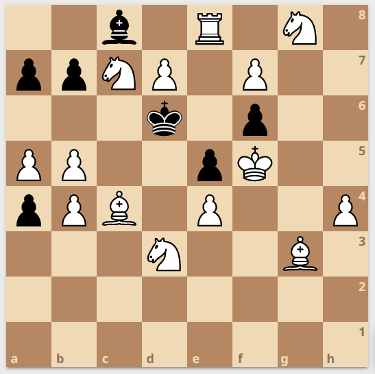

Some days ago I was watching a chess game and took note of a nice position that came up. Later that day, I came across my young sister.

"Elva", I said to her, "look at this board from today's game. White to move. How odd it is!"; to which she answered, sharp as always, "It doesn't seem to have lasted long. Mate in one.". Didn't even blink!

Below's the board that I showed Elva. A pawn is missing (but only from the board below, i.e. Elva saw the complete board).

- Can you determine where the missing pawn was?
- How did Elva spot the mate in one?

The solution

The only possibility is for a white pawn to be on d5 and to capture black's pawn on d4 <em>en passant</em>. But how did Elva see that such a move was legal? Her only information was the full board and the fact that it came from a true game. Elva must have thought backwards to deduce that black's last move was a 2-square push of the e pawn. Let's then answer this question: <em>what was black's last move?</em>
<ul>
  <li>Clearly black didn't move the bishop.</li>
  <li>They neither moved the king as it would have previously been in a double check.</li>
  <li>The last move must have been ...e5 or ...</li>
</ul>

